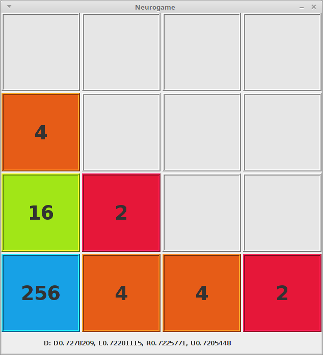

# neurogame

Game 2048 with neural net.



Start game.

```
java -jar neurogame.jar
```

Control.

- arrow keys - move
- 'f1' - save game
- 'f2' - load game
- 'n' - start new game
- 'l' - learn your moves

The network gives four outputs from 0 to 1 for each direction and the final decision.
